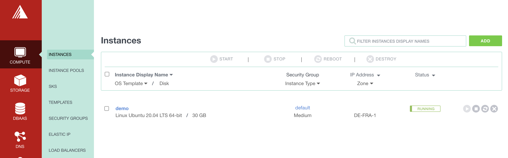
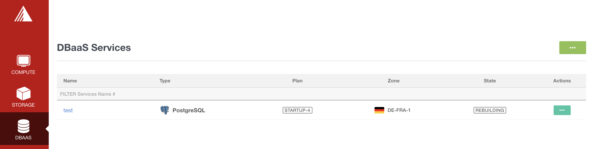
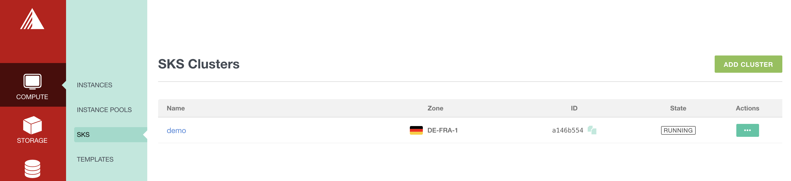

# Terrajet Exoscale Provider

`provider-jet-exoscale` is a [Crossplane](https://crossplane.io/) provider that
is built using [Terrajet](https://github.com/crossplane-contrib/terrajet) code
generation tools and exposes XRM-conformant managed resources for the Exoscale API.

# Status

Warning: this is a WIP, currently for testing purposes and not yet in an alpha version :)

Only a limited number of resources are taken into account and not fully tested:
- instances
- sks cluster (with related nodepool and security group)
- nodepool
- security group
- security group rule
- DBaas

Note: additional tests are currently on-going to play with Crossplane specific resources:
- CompositeResourceDefinition (XRD)
- CompositeResource (XR)
- Composition
- Claims

More on that soon...

## Getting Started

0. Pre-requisites

You need:
- a kubernetes cluster (easy to set up using [Kind](https://kind.sigs.k8s.io/docs/user/quick-start/))
- kubectl
- helm

1. Install crossplane

Crossplane can be installed with Helm using the command below:

```
kubectl create namespace crossplane-system

helm repo add crossplane-stable https://charts.crossplane.io/stable
helm repo update

helm install crossplane --namespace crossplane-system crossplane-stable/crossplane
```

The crossplane cli can be installed with the following command:

```
curl -sL https://raw.githubusercontent.com/crossplane/crossplane/release-1.5/install.sh | sh
```

2. Create a secret containing Exoscale creds

Set Exoscale Key and Secret as env variables:

```
export EXOSCALE_API_KEY=...
export EXOSCALE_API_SECRET=...
```

Create a secret containing those credentials:

```
cat <<EOF | kubectl apply -f -
apiVersion: v1
kind: Secret
metadata:
  name: exoscale-creds
  namespace: crossplane-system
type: Opaque
stringData:
  credentials: |
    {
      "key": "${EXOSCALE_API_KEY}",
      "secret": "${EXOSCALE_API_SECRET}"
    }
EOF
```

3. Provider installation

Install the Exoscale provider by using the following command replacing:
- ARCH with arm64 or amd64

```
kubectl crossplane install provider lucj/provider-jet-exoscale-ARCH:latest
```

4. Create a provider configuration

```
cat <<EOF | kubectl apply -f -
apiVersion: exoscale.jet.crossplane.io/v1alpha1
kind: ProviderConfig
metadata:
  name: exoscale
spec:
  credentials:
    source: Secret
    secretRef:
      name: exoscale-creds
      namespace: crossplane-system
      key: credentials
EOF
```

5. Create Exoscale resources directly:

- Compute instance

```
$ kubectl apply -f examples/compute/instance.yaml
```

From your Exoscale portal you will see a new compute instance



- DBaas

```
$ kubectl apply -f examples/database/database.yaml
```

From your Exoscale portal you will see a new Postgres instance



- SKS cluster

```
$ kubectl apply -f examples/sks/sks.yaml
```

From your Exoscale portal you will see a new SKS cluster and a nodepool attached to that one.
Each node of that nodepool belongs to a new security group created alongside the cluster.



The 3 resources above appear as managed resources, in a couple of seconds they are in synced (meaning
that the specification is in sync with the acutal resource existing in the cluster):

```
$ watch kubectl get managed 

Every 2.0s: kubectl get managed                                                                                                                     jupiter.local: Wed Dec  8 16:47:03 2021

NAME                                               READY   SYNCED   EXTERNAL-NAME                          AGE
instance.compute.exoscale.jet.crossplane.io/demo   True    True     89a679c2-f5ef-4d6e-852e-757b0840c6b0   3m49s

NAME                                              READY   SYNCED   EXTERNAL-NAME   AGE
database.database.exoscale.jet.crossplane.io/db   True    True     test            3m39s

NAME                                          READY   SYNCED   EXTERNAL-NAME                          AGE
cluster.sks.exoscale.jet.crossplane.io/demo   True    True     a144b2f4-0091-4090-be69-3cdcd6a097de   3m26s
```

Removing the resources from the cluster only requires the usual `kubectl delete`:

```
kubectl delete instance demo
kubectl delete database db
kubectl delete cluster demo
```

6. Using CompositeResourceDefinition / CompositeResource / Composition / Claim

As we've seen in the previous part, it's very easy to create managed resources directly. But very often we'll want to deploy an infrastructure that is composed of several managed resources in a more dynamic way. Also, we sometimes need to hide all the internal complexity to users so they can use a simple (dedicated) resource to create a whole set of dependent managed resources. That is where Crossplane also shines as it allows to define CompositeResourceDefinitions (specialized CustomResourceDefinition), Compositions and Claims for those purposes.

First we use the following command to create a CompositeResourceDefinition (XRD):

```
kubectl apply -f examples/XRDs/xcluster.yaml
```

It basically defines a new type of resource in Kubernetes:
- of type xclusters.sks.exoscale.com
- with a single property: *name* defined as a string

Next we create a Composition:

```
kubectl apply -f examples/Compositions/cluster.yaml
```

That one defines the list of dependent managed resources needed to create an Exoscale SKS cluster:
- the cluster's control plane
- a sample nodepool with 2 VMs
- the securitygroup (and associated security group rules) the nodepool belongs to

XRDs and Compositions are often created by administrators / SREs as they can be very complicated resources that the end users do not need to know anything about.

In order to allow users to create a cluster we will provided them a new kind of resource (also references as Claims) with the minimum information they need:

As a user I could only create the following resource:
```
$ cat <<EOF | kubectl apply -f -
apiVersion: sks.exoscale.com/v1alpha1
kind: Cluster
metadata:
  name: my-dev-cluster
spec:
  parameters:
    name: "dev-cluster"
  compositionRef:
    name: cluster
EOF
```

This will trigger the creation of an Exoscale SKS cluster (Cluster resource within the sks.exoscale.com group) through Crossplane managed resources.

We can list the Clusters and the managed resources with the following commands:

```
$ kubectl get cluster
NAME             READY   CONNECTION-SECRET   AGE
my-dev-cluster   True                        4m36s
```

```
$ kubectl get managed
NAME                                                                                READY   SYNCED   EXTERNAL-NAME                          AGE
securitygroup.securitygroup.exoscale.jet.crossplane.io/my-dev-cluster-nvnd8-dmvst   True    True     0e7cd0b1-16ac-4bd9-853f-d56a3379b3f6   2m4s

NAME                                                                                        READY   SYNCED   EXTERNAL-NAME                          AGE
securitygrouprule.securitygrouprule.exoscale.jet.crossplane.io/my-dev-cluster-nvnd8-kgbfx   True    True     72453f6c-8da3-4963-a431-464534117ef2   2m4s
securitygrouprule.securitygrouprule.exoscale.jet.crossplane.io/my-dev-cluster-nvnd8-kkz8j   True    True     3bb08d0e-07a5-4aa8-aad3-c1ee741b6065   2m3s
securitygrouprule.securitygrouprule.exoscale.jet.crossplane.io/my-dev-cluster-nvnd8-rtbg7   True    True     f249c7ae-0291-4c95-a486-09a70b29f2e9   2m4s
securitygrouprule.securitygrouprule.exoscale.jet.crossplane.io/my-dev-cluster-nvnd8-tnbjl   True    True     dd8d40de-8ef4-4113-b036-1e478fc5c71c   2m3s
securitygrouprule.securitygrouprule.exoscale.jet.crossplane.io/my-dev-cluster-nvnd8-xb4f7   True    True     28f1e93a-d4db-40da-a581-43aa21237484   2m3s

NAME                                                                 READY   SYNCED   EXTERNAL-NAME                          AGE
nodepool.sks.exoscale.jet.crossplane.io/my-dev-cluster-nvnd8-fzvm4   True    True     44416c2a-a6d6-42c9-8ddf-ee3206a25413   2m3s

NAME                                                                READY   SYNCED   EXTERNAL-NAME                          AGE
cluster.sks.exoscale.jet.crossplane.io/my-dev-cluster-nvnd8-gvfs9   True    True     f66791f1-6680-4058-bc6a-fe03815e083a   2m4s
```

Note: a few tens of seconds are required to have all the resources in Sync.

That cluster can easily be deleted:

```
$ kubectl delete cluster my-dev-cluster
cluster.sks.exoscale.com "my-dev-cluster" deleted
```

## Report a Bug

For filing bugs, suggesting improvements, or requesting new features, please
open an [issue](https://github.com/lucj/provider-jet-exoscale/issues).

## Governance and Owners

provider-jet-exoscale is run according to the same
[Governance](https://github.com/crossplane/crossplane/blob/master/GOVERNANCE.md)
and [Ownership](https://github.com/crossplane/crossplane/blob/master/OWNERS.md)
structure as the core Crossplane project.

## Code of Conduct

provider-jet-exoscale adheres to the same [Code of
Conduct](https://github.com/crossplane/crossplane/blob/master/CODE_OF_CONDUCT.md)
as the core Crossplane project.

## Licensing

provider-jet-exoscale is under the Apache 2.0 license.
